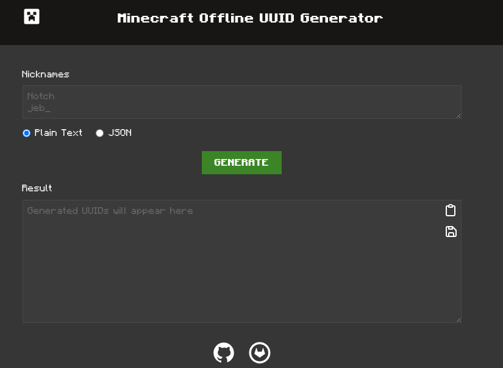

# Minecraft Offline UUID Generator


## Preview



You can view the page using one of the following URLs:

- [Github URL](https://nuckle.github.io/minecraft-offline-uuid-generator/) 
- [Gitlab URL](https://w973.gitlab.io/minecraft-offline-uuid-generator/)

## Features 

- supports different syntax (plain text/json)
- ability to download output 
- can be locally installed using PWA

## Requirements

- `Node.JS` 18.x.x
- `git`

## Build 

```sh
$ git clone https://gitlab.com/w973/minecraft-offline-uuid-generator.git # or https://nuckle.github.io/minecraft-offline-uuid-generator/
$ cd minecraft-offline-uuid-generator/
$ npm install i
$ npm run build
```

Your build will be at `dist` directory


