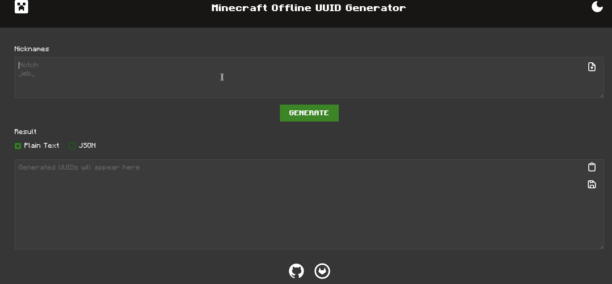

# Minecraft Offline UUID Generator


## Preview



You can view the page using one of the following URLs:

- [Github URL](https://nuckle.github.io/minecraft-offline-uuid-generator/) 
- [Gitlab URL](https://w973.gitlab.io/minecraft-offline-uuid-generator/)

## Features 

- dark and light theme
- keyboard friendly
- drag and drop support for username file
- output as json or plain text 
- an ability to download output 
- can be locally installed as PWA
- syntax highlighting
- mojang api support (via `api.ashcon.app`)

## Requirements

- `Node.JS` 18.x.x
- `git`

## Build 

```sh
$ git clone https://gitlab.com/w973/minecraft-offline-uuid-generator.git # or https://github.com/nuckle/minecraft-offline-uuid-generator.git
$ cd minecraft-offline-uuid-generator/
$ npm i
$ npm run build
```

Your build will be at `dist` directory

**NOTE**: a local web server is required


